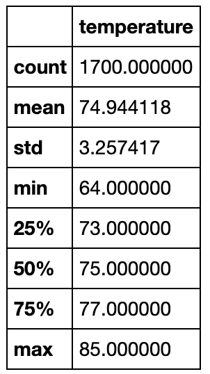
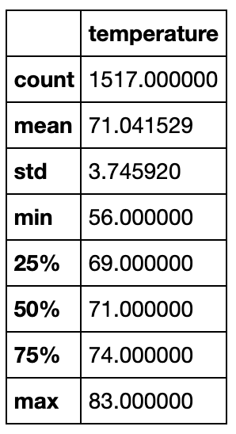

# SurfsUp Challenge

## Section 1: Overview of the Statistical Analysis

### Purpose

The purpose of the analysis is to utilize SQLAlchemy methods to connect to a SQLite object and query information about weather conditions (temperature and precipitation) for dates within the month of June and December. 

## Section 2: Results

### Temperature Statistics for June

### Temperature Statistics for December

### Three Differences between June and December

* Sample size for June (1,700) is larger than December's (1,517). Whether or not these are both sufficient depends upon what one may assume about the distribution of the population under study.
* Standard deviation for June (3.26) is smaller than December's (3.75), meaning there seems to be more variability in temperature conditions for days in December.
* The median for temperature in June (75.00) is slightly bigger than the mean (74.94), which might suggest the presence of negative skewness. On the other hand, the median for temperature in December (71.00) is sligly smaller than the mean (71.04), which might suggest the presence of positive skewness. 

## Section 3: Summary

### Two Additional Queries

Two additional queries were performed to calculate descriptive statistics for precipitation conditions. The results of these queries can be consulted in "SurfsUp_Challenge.ipynb". The results of this queries will be used to inform the summary provided below.

### Sumamry

In terms of summarizing the results of calculating decriptive statistics for temperature and precipitation for the months of June and December in Hawaii, not a lot can be concluded. Nevertheless, it seems reasonable to suggest, based on the statistics, that temperature in June is hotter than in December. On the other hand, there seems to be more precipitation in December, historically, that there has been in June. 

